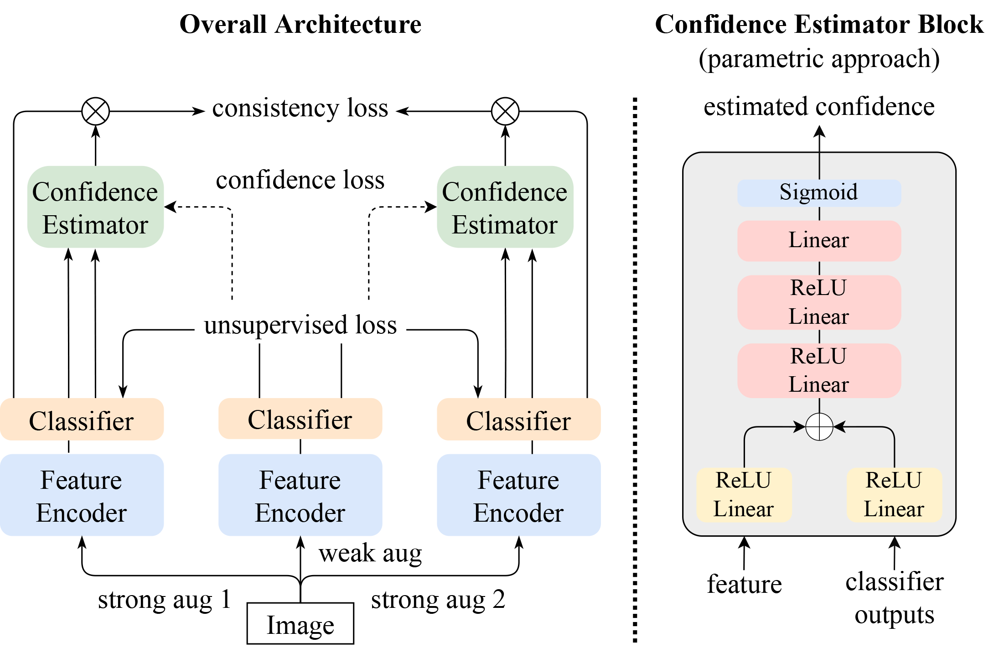

## ConMatch - Official Pytorch Implementation
<p align="middle"></p>

> **ConMatch: Semi-Supervised Learning with Confidence-Guided Consistency Regularization**<br>
> Jiwon Kim, Youngjo Min, Daehwan Kim, Gyuseong Lee, Junyoung Seo, Kwangrok Ryoo, Seungryong Kim<br>
> In ECCV 2022. [[arxiv](https://arxiv.org/abs/2208.08631)]<br>

> **Abstract:** *We present a novel semi-supervised learning framework that intelligently leverages the consistency regularization between the model's predictions from two strongly-augmented views of an image, weighted by a confidence of pseudo-label, dubbed ConMatch. While the latest semi-supervised learning methods use weakly- and strongly-augmented views of an image to define a directional consistency loss, how to define such direction for the consistency regularization between two strongly-augmented views remains unexplored. To account for this, we present novel confidence measures for pseudo-labels from strongly-augmented views by means of weakly-augmented view as an anchor in non-parametric and parametric approaches. Especially, in parametric approach, we present, for the first time, to learn the confidence of pseudo-label within the networks, which is learned with backbone model in an end-to-end manner. In addition, we also present a stage-wise training to boost the convergence of training. When incorporated in existing semi-supervised learners, ConMatch consistently boosts the performance. We conduct experiments to demonstrate the effectiveness of our ConMatch over the latest methods and provide extensive ablation studies. Source code is available at https://github.com/JiwonCocoder/ConMatch.*

## Installation

### Clone this repository

```bash
git clone https://github.com/JiwonCocoder/ConMatch.git
cd ConMatch/
```

### Install the dependencies

```bash
conda env create -f environment.yml
```
When using 3090 GPUs,
```bash
conda env create -f environment3090.yml
```

### Run the experiments

1. Modify the config file in `config/conmatch/*.yaml`
2. Run `python conmatch.py --c config/conmatch/*.yaml`

## Main Results

### CIFAR-10 and CIFAR-100

This table shows error rates comparison on CIFAR-10 and CIFAR-100

|                      | CIFAR-10           |    |            |      CIFAR100      |    |            
|----------------------|------------|------------|------------|------------|------------|
|                      | 40         | 250        | 4000       | 400        | 2500       |
| UDA       |  29.05±5.93 |  8.82±1.08 |  4.88±0.18 |  59.28±0.88 |  33.13±0.22   |
| FixMatch (RA)       |  13.81±3.37 |  5.07±0.65 | 4.26±0.06 |  48.85±1.75 |  28.29±0.11|
| FlexMatch       |  4.97±0.06 |  4.98±0.09 |  4.19±0.01 | 39.94±1.62 | 26.49±0.20|
| SelfMatch       |  6.81±1.08 |  4.87±0.26 | 4.06±0.08 |  - |  - |
| CoMatch       |  6.91±8.47 |  4.91±0.33 |  - |  - |  -  |
| LESS      | 6.80±1.10 | 4.90±0.80 | - | 48.70±12.40 | -|
| Dash (RA)       |  13.22±3.75 | 4.56±0.13 |  4.08±0.06 |  44.76±0.96 |  27.18±0.21|
|ConMatch-NP |  4.89±0.07 | 5.00±0.37 |  4.36±0.42  | 44.90±1.34 | 26.91±1.35 |
|ConMatch-P   | 4.43±0.13  | 4.70±0.25 |3.92±0.08| 38.89±2.18  | 25.39±0.20|

## Citation
If you find this work useful for your research, please cite our paper:
```bibtex
@inproceedings{kim2022conmatch,
  title={ConMatch: Semi-Supervised Learning with Confidence-Guided Consistency Regularization},
  author={Kim, Jiwon and Min, Youngjo and Kim, Daehwan and Lee, Gyuseong and Seo, Junyoung and Ryoo, Kwangrok and Kim, Seungryong},
  booktitle={European Conference on Computer Vision},
  year={2022}
}
```

## ImageNet Dataset
ImageNet datasets can be downloaded from the [official site](https://image-net.org/challenges/LSVRC/2012/2012-downloads.php) and follow the guide described in [TorchSSL](https://github.com/TorchSSL/TorchSSL).

## Related Projects 

Our model code starts from [TorchSSL](https://github.com/TorchSSL/TorchSSL).
